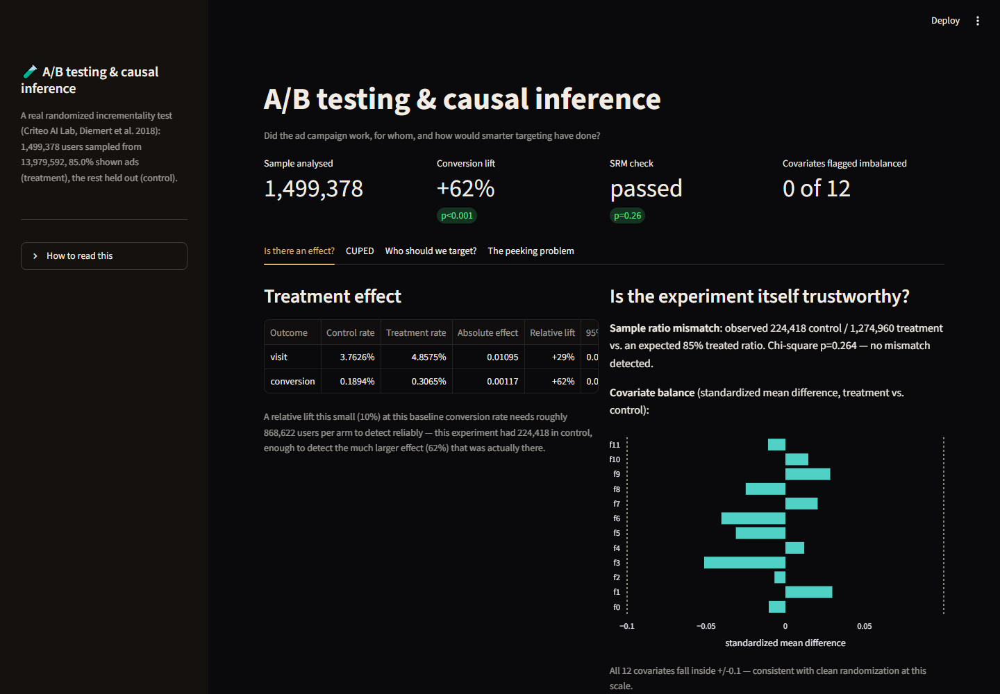
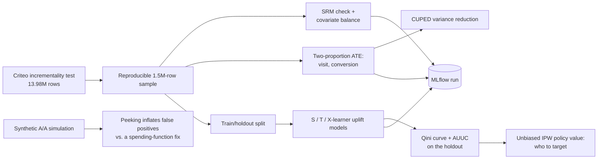
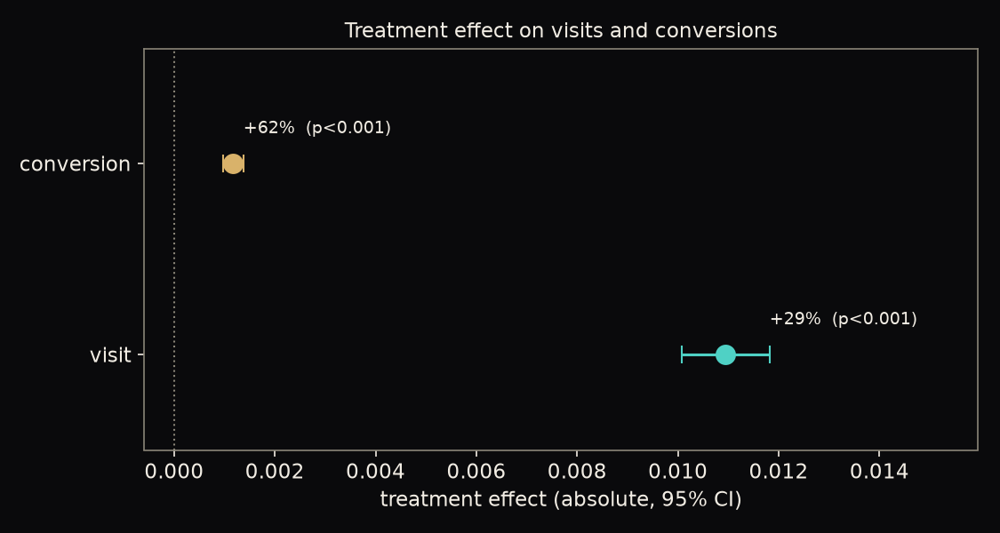
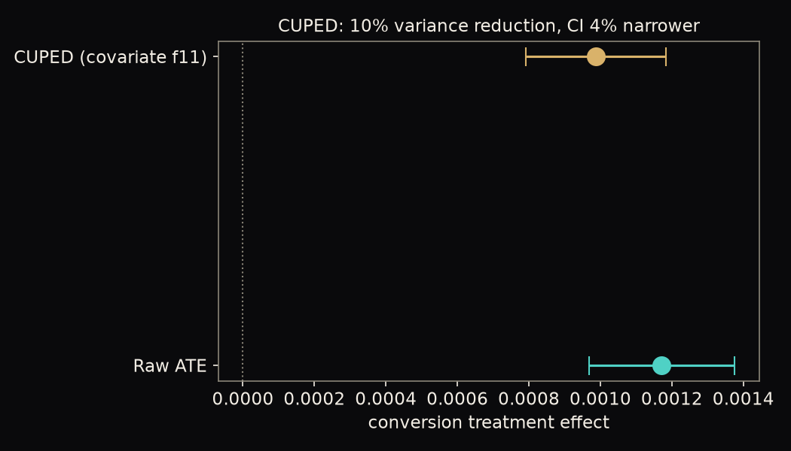
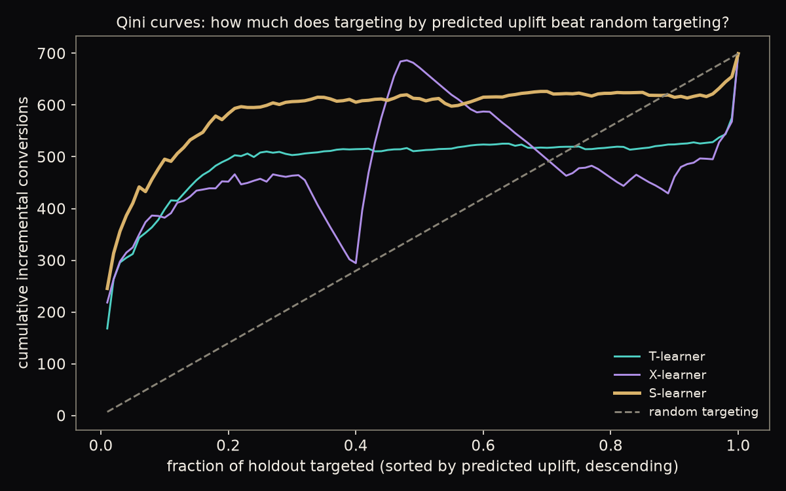
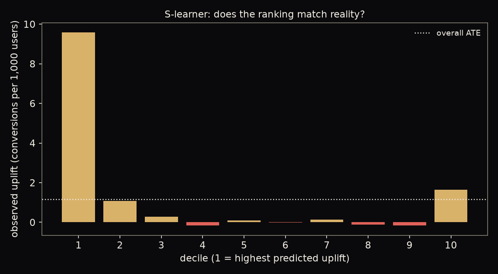
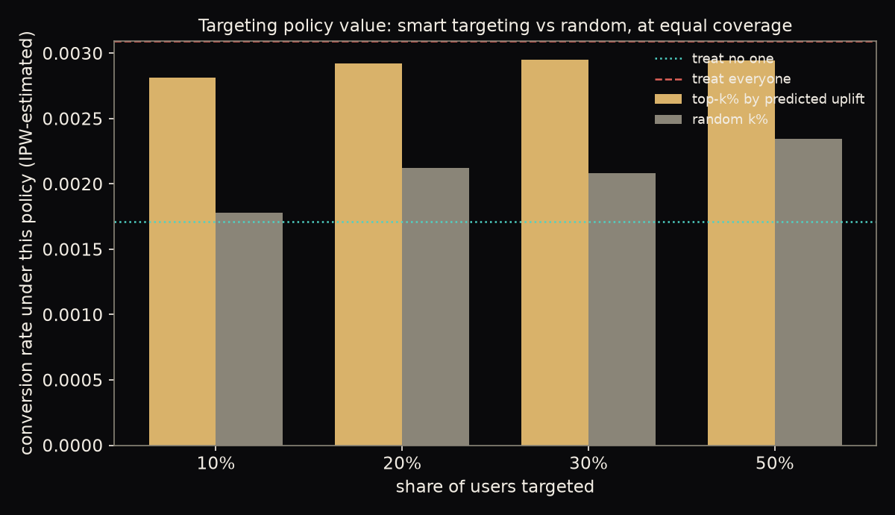
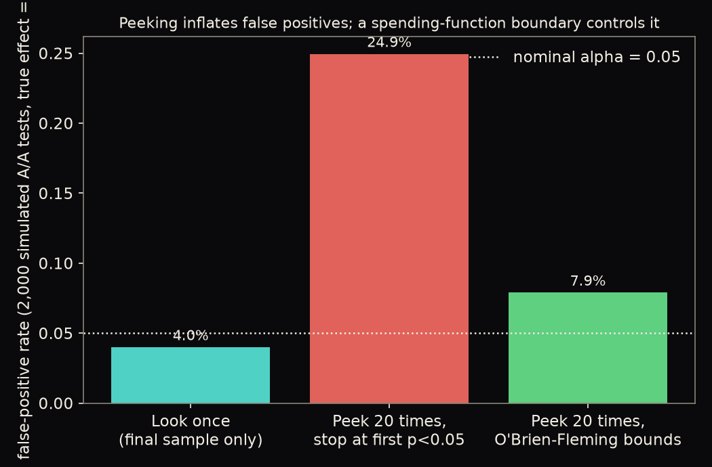
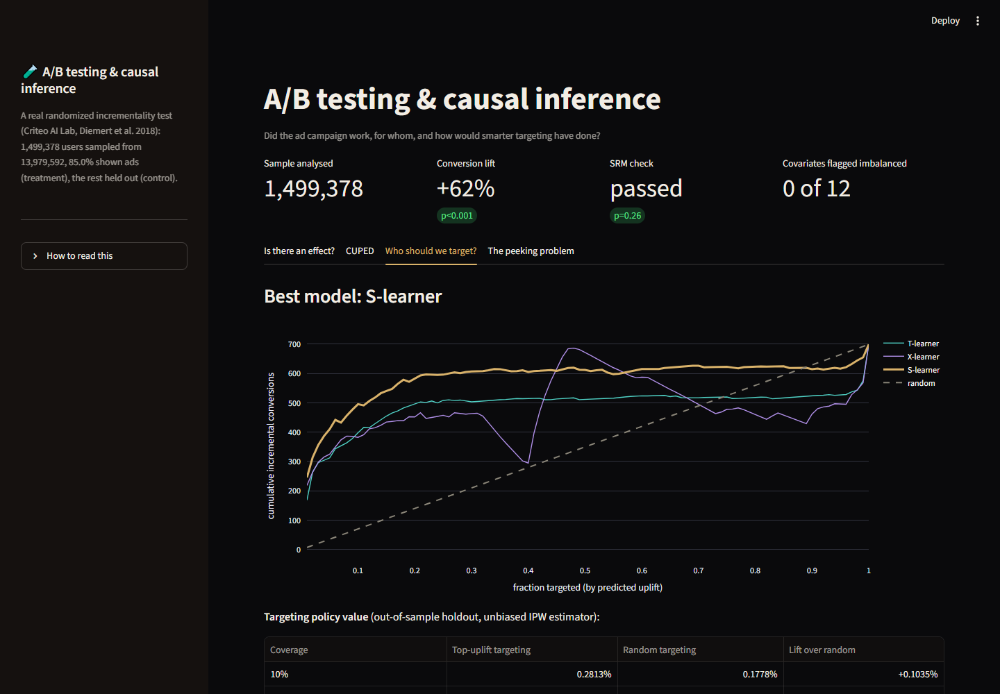
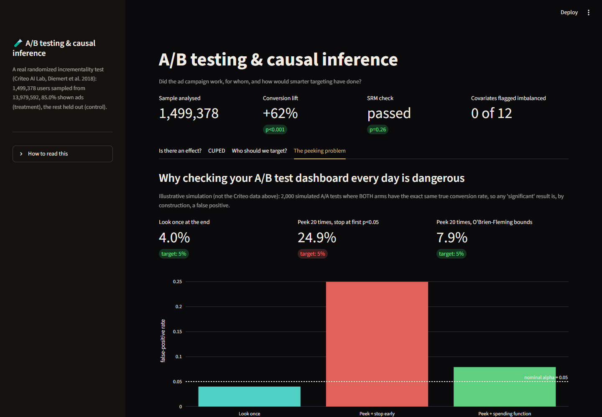

# A/B Testing & Causal Inference: A Real Randomized Ad-Incrementality Experiment

Was a real randomized ad campaign effective, is the experiment itself trustworthy, and who should have been
targeted? Runs the full toolkit on a genuine 1.5M-user randomized incrementality test: sample-ratio-mismatch
and covariate-balance health checks, a two-proportion effect estimate with power context, **CUPED** variance
reduction, three uplift models (**S/T/X-learners**) compared on a **Qini curve** with an unbiased off-policy
value estimate for "who to target," and a labelled simulation showing exactly how much **peeking** at a
dashboard inflates false positives.

**Live demo:** _added after deployment_ · **Stack:** LightGBM, SciPy, statsmodels, MLflow, Streamlit + Plotly



## 1. Business problem

| | |
|---|---|
| **Stakeholder** | Marketing / growth team running a paid-ad incrementality test |
| **Decision** | Did the campaign cause more visits and conversions? Is the experiment itself trustworthy? Which users should be targeted next time, and how much did checking results early cost in false alarms? |
| **KPIs** | Absolute and relative lift in visits and conversions, with proper confidence intervals; sample-ratio-mismatch and covariate-balance diagnostics; CUPED variance reduction; targeting-policy value (AUUC, Qini, out-of-sample IPW) |

## 2. Data

**Criteo AI Lab's public uplift-modeling benchmark** (Diemert, Betlei, Renaudin & Amini, 2018, AdKDD): a real
randomized incrementality test — a random slice of users was withheld from ad targeting (control), the rest
were eligible to see ads (treatment, 85%). 13,979,592 rows, 12 anonymised dense features (privacy: the
provider projects and hides the real fields, so — as with the fraud project in this portfolio — explanations
name feature indices, not real attributes), a treatment flag, and two binary outcomes: `visit` and
`conversion`. Public, no login. Licence: **CC-BY-NC-SA 4.0** (non-commercial; this is a portfolio demo).

A reproducible random 1,499,378-row sample (kept via a fixed-seed Bernoulli filter while streaming the 311 MB
gzip, so no 14M-row file ever loads into memory) is used throughout; every result below is computed on it and
cached in `artifacts/results.json`.

## 3. Architecture



## 4. Is the experiment itself trustworthy?

Two checks that must pass before any effect estimate means anything:

| Check | Result |
|---|---|
| **Sample ratio mismatch** (observed vs. nominal 85% treated) | 224,418 control / 1,274,960 treatment. Chi-square p = 0.264 — **no mismatch** |
| **Covariate balance** (standardized mean difference, treatment vs. control, 12 features) | **0 of 12** flagged (all \|SMD\| < 0.1) |


Randomization looks clean at this scale — worth checking every time, because every number below depends on it.

## 5. Is there a treatment effect?

| Outcome | Control rate | Treatment rate | Absolute lift | Relative lift | 95% CI | p-value |
|---|---|---|---|---|---|---|
| Visit | 3.76% | 4.86% | +0.0109 | **+29%** | 0.0101 to 0.0118 | < 0.001 |
| Conversion | 0.189% | 0.307% | +0.00117 | **+62%** | 0.00097 to 0.00138 | < 0.001 |



Both effects are large and highly significant (z > 11 for conversion). For context: detecting a *10%*
relative lift in conversion at this baseline rate would need **~869,000 users per arm** — this experiment had
224k in control, nowhere near enough for a 10% effect, but the *actual* effect (62%) was so large it was
easily detected anyway. A more realistic, smaller campaign effect could easily have been missed at this
control-arm size — a concrete illustration of why power calculations happen *before* running a test, not after.

## 6. CUPED: shrinking the interval, honestly

CUPED (Deng et al., 2013) removes the part of the outcome linearly predictable from a covariate that is
independent of treatment (randomized, so nothing here can bias the estimate), shrinking the confidence
interval without moving the point estimate.



| | Raw | CUPED-adjusted |
|---|---|---|
| Conversion ATE | 0.001171 | 0.000988 |
| 95% CI | 0.000968 to 0.001375 | 0.000792 to 0.001183 |
| Variance reduction | — | **10.1%** |
| CI width reduction | — | **4.3%** |

**Honest result: the gain is modest.** Conversion is rare (0.29%), so most of its variance is simply not
explainable by any one covariate — the best available anonymised feature (`f11`) correlates only weakly with
it. CUPED earns its keep most on continuous, high-variance metrics (revenue, session length, time-on-site)
with a genuinely predictive pre-period covariate; this dataset offers neither for the conversion outcome. The
point estimate barely moved (0.001171 -> 0.000988, well inside the raw CI), which is the correctness check:
CUPED must not change *what* is being estimated, only its precision.

## 7. Who should be targeted? Uplift modeling

Three heterogeneous-treatment-effect models (S/T/X-learner, all LightGBM) are trained on 60% of the sample and
graded on the other 40%, never touched during training.



| Model | AUUC (holdout) |
|---|---|
| Random targeting | 349.6 |
| X-learner | 475.5 |
| T-learner | 488.8 |
| **S-learner (best)** | **582.3** |

**The simplest model won.** The X-learner's Qini curve is visibly unstable (a sharp spike-and-crash around
the 40-50% mark) — with a fairly homogeneous treatment effect and no strong per-user confounding to correct
for, the X-learner's extra machinery (impute individual effects from the *other* arm's model, then re-regress
them, then blend by propensity) adds variance without adding signal. The plain S-learner, one model with
treatment as a feature, generalised best on this holdout.

### Where the effect actually lives



Ranking users by predicted uplift and slicing into deciles shows the measurable effect concentrates almost
entirely in **decile 1**; deciles 2-10 sit noisily around the overall ATE because conversion is rare (a few
thousand events spread across ~60,000 users per decile — individual decile estimates carry real sampling
noise, most visible in the erratic decile 10, which should not be over-interpreted).

### Does smarter targeting actually pay off?



Every number below is an **unbiased inverse-propensity-weighted estimate on the holdout** — valid because the
real treatment assignment was genuinely randomized with a known probability, not because any model is assumed
correct:

| Coverage | Top-uplift targeting | Random targeting | Lift over random |
|---|---|---|---|
| 10% | 0.2813% | 0.1778% | **+0.1035%** |
| 20% | 0.2924% | 0.2118% | +0.0806% |
| 30% | 0.2951% | 0.2078% | +0.0873% |
| 50% | 0.2939% | 0.2341% | +0.0598% |
| 100% (treat everyone) | 0.3085% | — | — |

Targeting by predicted uplift beats random targeting of the *same size* at every coverage level tested, most
strongly at 10% coverage — a legitimate "spend less, capture more" result. Read alongside the decile chart
above: a large share of that edge rides on correctly identifying the single best-responding decile, so treat
the headline "smart targeting wins" as real but concentrated, not evenly spread across the ranked list.

## 8. The peeking problem

A separate, clearly labelled simulation — **not** the Criteo data above — of what happens when a team checks
an A/B test dashboard repeatedly and stops as soon as it looks significant: 2,000 simulated **A/A tests**
where both arms have the exact same true conversion rate, so any "win" is a false positive by construction.



| Strategy | False-positive rate (nominal alpha = 5%) |
|---|---|
| Look once, at a fixed final sample | 4.0% |
| **Peek 20 times, stop at the first p < 0.05** | **24.9%** |
| Peek 20 times, O'Brien-Fleming alpha-spending boundary | 7.9% |

Peeking and stopping early **inflates the false-positive rate roughly 6x** above nominal — a real, common
mistake with no bad intent behind it, just checking the dashboard too often. A pre-registered sequential
boundary (stricter early, relaxing toward the nominal alpha at the final look) brings it most of the way back
down. Try it yourself in the app's "The peeking problem" tab.

## 9. The app

`app/streamlit_app.py`, four tabs: **Is there an effect?** (ATE + SRM + covariate balance), **CUPED**,
**Who should we target?** (Qini curve, deciles, policy value), **The peeking problem** (the simulation above,
plus a slider to run your own).

| Uplift targeting | Peeking simulation |
|---|---|
|  |  |

## 10. Limitations

- **Anonymised features.** As with the fraud-detection project in this portfolio, `f0`-`f11` are provider-
  anonymised dense projections; uplift explanations name feature indices, not real attributes.
- **CUPED's payoff here is small** because conversion is rare and no covariate is strongly predictive —
  reported honestly rather than swapped for a flattering outcome metric.
- **The X-learner underperforming is a finding about this dataset's effect structure** (homogeneous, no
  strong confounding), not a general claim that X-learners are worse than S-learners.
- **The peeking simulation is synthetic**, run on simulated A/A data with a known true null, specifically so
  the "inflation" number is exact and reproducible — it is not derived from the real Criteo experiment.
- **Non-commercial licence (CC-BY-NC-SA)**: the data is used here for a portfolio demonstration, not resold
  or used commercially; the full dataset is not redistributed, only a derived random sample.
- **A 40/60 holdout split for uplift modeling** is one arbitrary choice; policy values would tighten with a
  larger holdout at the cost of a smaller training set.

## 11. Run it

```bash
uv sync --all-groups
uv run python -m abtest.train    # downloads the data (~311 MB), samples 1.5M rows, runs everything (~7 min)
uv run python -m abtest.report   # figures
uv run streamlit run app/streamlit_app.py
uv run pytest -q && uv run ruff check .
```

Every metric is also logged to MLflow (`mlflow.db`, experiment `abtest`):
`python -m mlflow ui --backend-store-uri sqlite:///mlflow.db`.

```
src/abtest/   config, data (download, sampling), stats (SRM, balance, ATE, CUPED), uplift (S/T/X-learners,
              Qini, IPW policy value), peeking (simulation), train, report
app/          Streamlit app
artifacts/    results.json, qini_*.parquet, holdout_scored_sample.parquet
notebooks/    01_ab_testing_analysis.ipynb (executed)
tests/        16 offline tests on synthetic data with known ground truth
```

**Deploy:** Streamlit Community Cloud (main file `app/streamlit_app.py`) or the included `Dockerfile`. CI runs
ruff and pytest on every push.

## Attribution and license

Code: MIT (`LICENSE`). Data: Criteo AI Lab's uplift-modeling benchmark, CC-BY-NC-SA 4.0, used here for
non-commercial portfolio demonstration. Please cite: *Diemert, E., Betlei, A., Renaudin, C., Amini, M-R.
(2018). A Large Scale Benchmark for Uplift Modeling. Proceedings of the AdKDD and TargetAd Workshop, KDD,
London, United Kingdom.*
